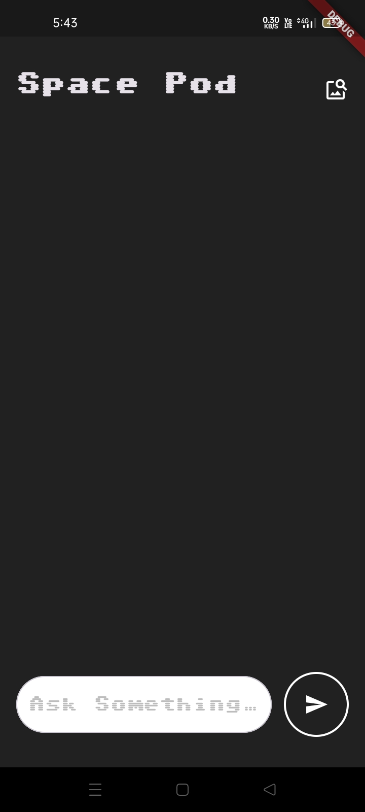
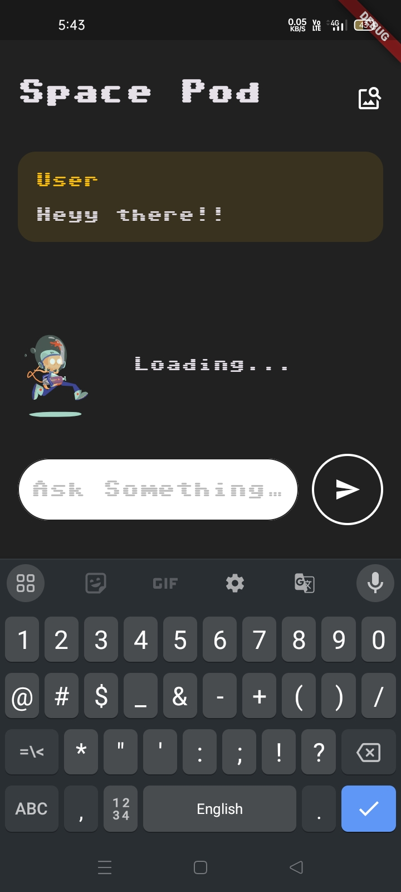
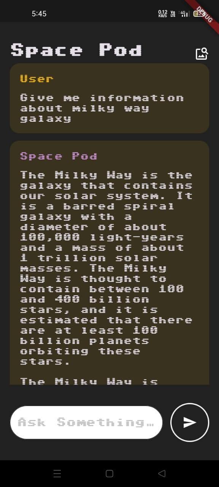

# Space Information Chatbot

## Brief Description
The project is a chatbot application designed to provide users with detailed and accurate information about space. The app leverages Gemini, Google's advanced large language model (LLM), to access a wide array of space-related data. The application is built using the Flutter framework, ensuring a smooth and responsive user experience across multiple platforms. State management is efficiently handled by the BLoC (Business Logic Component) pattern, and engaging animations are incorporated using Lottie.

## Objective and Scope
### Objective
The primary objective of this project is to develop a robust and interactive chatbot that serves as a centralized platform for users to access comprehensive information about space. The application aims to deliver accurate, real-time data in an engaging and user-friendly manner, catering to a wide audience, from space enthusiasts to researchers.

### Scope
- Provide comprehensive information on various space-related topics, including planets, stars, galaxies, and current space missions.
- Offer an interactive and engaging user experience through a chatbot interface.
- Cater to a wide range of users, from space enthusiasts to students and researchers.

## Methodology
- **Requirement Analysis:** Identify the key features and functionalities required for the chatbot.
- **Design:** Create wireframes and design the UI/UX of the application.
- **Development:** Build the application using Flutter, integrate the Gemini API for data, implement state management with BLoC, and add animations using Lottie.
- **Testing:** Conduct thorough testing to ensure the application is bug-free and performs well.
- **Deployment:** Publish the application on relevant platforms (e.g., Google Play Store, Apple App Store).
- **Maintenance:** Regularly update the app with new features and data.

## Hardware and Software Requirements
### Hardware
- A development machine with a modern processor, at least 8GB of RAM, and sufficient storage.

### Software
- Operating System: Windows, macOS, or Linux
- IDE: Android Studio, Visual Studio Code
- Programming Language: Dart
- Framework: Flutter
- API: Gemini API
- State Management: BLoC
- Animation: Lottie
- Version Control: Git

## Technologies
- **Flutter:** For building the cross-platform mobile application.
- **Dart:** Programming language used with Flutter.
- **Gemini API:** For fetching space-related data using Google's advanced large language model.
- **BLoC:** For state management.
- **Lottie:** For adding animations to the application.
- **Git:** For version control.

## Testing Techniques
- **Unit Testing:** To test individual components and functions of the application.
- **Integration Testing:** To ensure different parts of the application work together seamlessly.
- **UI Testing:** To validate the user interface and user experience.
- **Performance Testing:** To ensure the application performs well under various conditions.
- **User Acceptance Testing (UAT):** To get feedback from end-users and ensure the application meets their needs.

## Screenshots

